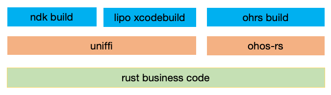

# Rust移动端跨平台开发实践
## 整体方案


Rust的移动端跨平台开发方案，具体如下
1. 最底层SDK的业务逻辑由Rust实现
2. 使用ffi工具，编写binding code
   1. Android、iOS：中间层使用uniffi编写binding代码。使用uniffi-bindgen将binding代码生成kotlin、Swift代码，方便Android、iOS调用。
   2. 鸿蒙：使用ohos-rs编写binding代码，使用ohos工具生成TypeScript代码方便鸿蒙调用
3. 构建工具
   1. Android: 最终使用ndk build的工具编译Android 平台的so
   2. iOS：未找到比较好用的工具，自行编写脚本构建xcframework
   3. 鸿蒙：最终使用ohrs build 构建鸿蒙平台的so

## 代码详解
该仓库可以作为一个Rust移动端跨平台开发的模版，通过init.py脚本可以快速初始化一个工程。
### init.py说明
```
Mobile Rust Arg Parser
optional arguments:

  -h, --help            show this help message and exit

  --lib_name LIB_NAME   lib name

  --android_ndk_home ANDROID_NDK_HOME

                        Android ndk

  --android_pkg_name ANDROID_PKG_NAME

                        kotlin code pkg name

  --ohos_ndk_home OHOS_NDK_HOME

                        Harmony os ndk
# example
python init.py --lib_name example
               --android_ndk_home /Users/xxx/Library/Android/sdk/ndk/27.0.11902837
               --android_pkg_name com.example.ffi
               --ohos_ndk_home /Users/xxx/Library/Huawei/Sdk/HarmonyOS-NEXT-DP2/base              
```
例如执行上述例子后，工程初始化为一个名叫example的库。
### mobile
该目录下包含src 和 bin两个目录，分别是SDK的业务逻辑代码和可执行程序。业务逻辑代码可以编译到Android、iOS、鸿蒙平台。可执行程序方便在rust层测试使用。
### uniffi
该目录是workspace，包含mobile-ffi、uniffi-bindgen、dist
#### mobile-ffi
该目录依赖uniffi工具对SDK的接口编写binding code，可以自动生成Kotlin、swift代码，方便Android、iOS调用。
#### uniffi-bindgen
该目录是源码依赖uniffi工具
#### dist
该目录下包括Android、iOS的构建产物
Android: 包含生成的kotlin代码、带符号、无符号的so，其中so包含arm64-v8a、armeabi-v7a
iOS：包含生成的swift代码和xcframework，其中xcframework包含ios-arm64、ios-arm64_x86_64-simulator
#### Android 脚本
build_android.sh 是构建Android产物的脚本，运行 sh build_android.sh 即可
#### iOS 脚本
build_ios_xc.sh 是构建iOS产物的脚本，运行 sh build_ios_xc.sh 即可
### ohos
该目录是依赖napi-ohos对SDK的接口编写binding code，可以自动生成TypeScript文件
#### dist
该目录下包含鸿蒙平台的构建产物，包含带符号、无符号的so，其中so包含arm64-v8a、armeabi-v7a、x86_64
#### 鸿蒙脚本
build_ohos.sh 是构建鸿蒙产物的脚本，运行 sh build_ohos.sh 即可